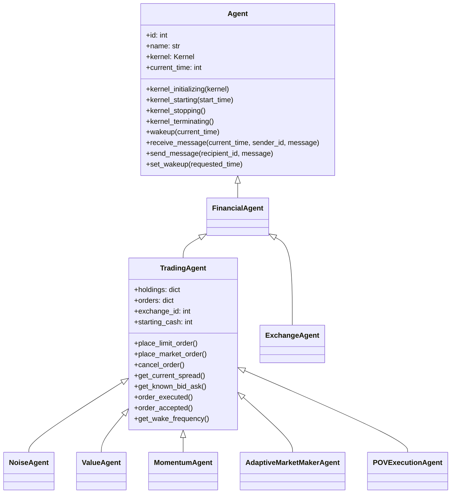
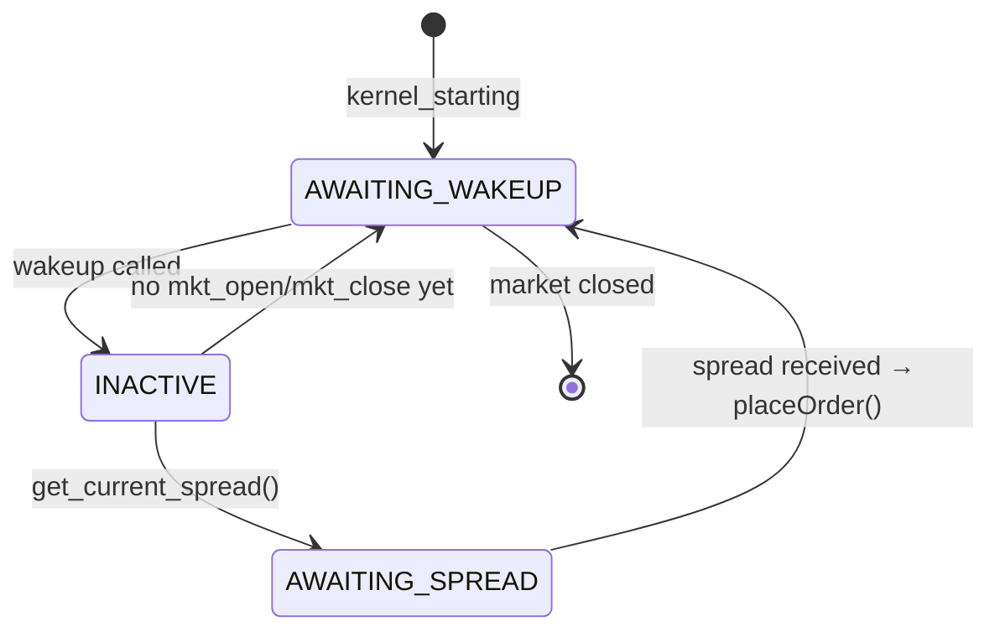
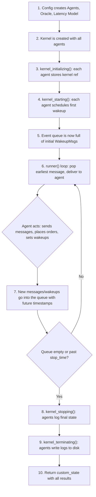

# ABIDES: The Complete Story — How the Simulation Really Works

> [!NOTE]
> This document walks you through the **entire simulation lifecycle** as a concrete story, so you can build a precise mental model before writing your own agent. Every concept maps to real code.

---

## 🗺️ The Big Picture (30-Second Version)

ABIDES is a **discrete-event simulation** of a financial market. Think of it like this:

```
┌──────────────────────────────────────────────────────────────────────┐
│                         THE UNIVERSE                                │
│                                                                     │
│   ┌──────────┐      ┌─────────────────────┐      ┌──────────────┐  │
│   │  Oracle   │      │       KERNEL        │      │  Order Book  │  │
│   │ (God's    │      │  (Postman + Clock)  │      │  (Inside the │  │
│   │  view of  │      │                     │      │   Exchange)  │  │
│   │  truth)   │      │  Priority Queue of  │      │              │  │
│   │           │      │     Messages        │      │  Bids & Asks │  │
│   └──────────┘      └─────────────────────┘      └──────────────┘  │
│         │                     │                          │          │
│         ▼                     ▼                          ▼          │
│   ┌──────────┐  ┌──────────┐  ┌──────────┐  ┌──────────────────┐   │
│   │  Value   │  │  Noise   │  │ Momentum │  │  Exchange Agent  │   │
│   │  Agent   │  │  Agent   │  │  Agent   │  │  (The NYSE of    │   │
│   │          │  │          │  │          │  │   this world)    │   │
│   └──────────┘  └──────────┘  └──────────┘  └──────────────────┘   │
│                                                                     │
│              ALL communication goes through the Kernel              │
│              (No agent can talk directly to another)                │
└──────────────────────────────────────────────────────────────────────┘
```

**The one-sentence summary:** The Kernel is a time-ordered mailroom. Agents live in isolated rooms. They can only interact by dropping letters (messages) into the Kernel's mailbox, and the Kernel delivers them in timestamp order, simulating network latency and computation time.

---

## Act 1: Setting the Stage — The Config File

> *"Before the market opens, somebody has to decide who shows up."*

Everything starts with a **config function** like [rmsc03.py](file:///d:/SKILLS/DREAM/ABIDES/abides-jpmc-public/abides-markets/abides_markets/configs/rmsc03.py). This is the "casting director" — it decides:

### 1.1 Who participates

```python
# From rmsc03.py — the cast of characters:
# - 1     Exchange Agent          (the stock exchange itself)
# - 2     Adaptive Market Makers  (provide liquidity)
# - 100   Value Agents            (fundamental traders)
# - 25    Momentum Agents         (trend followers)
# - 5000  Noise Agents            (random traders)
# - 1     POV Execution Agent     (algorithmic executor)
```

Each agent gets:
- A **unique integer ID** (0, 1, 2, ... — the Exchange is always 0)
- A **starting cash balance** (in cents! $100,000 = 10,000,000 cents)
- Agent-specific parameters (strategy knobs, symbol to trade, etc.)

### 1.2 The Oracle — "God's View" of the True Price

Before any agents are created, the config creates an **Oracle**:

```python
oracle = SparseMeanRevertingOracle(mkt_open, mkt_close, symbols)
```

The Oracle generates a **hidden fundamental value time series** for each stock. Think of it as: *"If all information were perfect and there were no market frictions, THIS would be the price at every nanosecond."*

The Oracle's job:
- Pre-computes the "true" price at every nanosecond from market open to close
- When an agent asks (via `oracle.observe_price()`), it returns the true price + **random noise** (the agent gets an imperfect observation)
- The Exchange Agent uses the oracle to set the **opening price**

> [!IMPORTANT]
> Agents **never see the true fundamental directly**. They get noisy observations. The noise level (`sigma_n`) controls how "informed" an agent is. An agent with `sigma_n=0` would see the truth perfectly — but that's reserved for the Exchange.

### 1.3 The Latency Model — Physics of Communication

```python
latency_model = generate_latency_model(agent_count)
```

This creates a model that simulates network delays between agents. When Agent A sends a message to Agent B, the Kernel adds a delay (in nanoseconds) before delivering it. This is how ABIDES simulates the real-world fact that information travels at finite speed.

### 1.4 The Config Returns a Dictionary

```python
return {
    "start_time": kernelStartTime,         # Midnight of the simulated date
    "stop_time": kernelStopTime,           # Market close + 1 minute buffer
    "agents": agents,                      # The list of ALL agent objects
    "agent_latency_model": latency_model,  # Network delay simulation
    "default_computation_delay": 50,       # 50 ns "thinking time" per agent action
    "custom_properties": {"oracle": oracle},  # Oracle attached as kernel property
}
```

---

## Act 2: Ignition — `abides.run()` Starts the Universe

The entry point is [abides.py](file:///d:/SKILLS/DREAM/ABIDES/abides-jpmc-public/abides-core/abides_core/abides.py). It does three things:

```python
# Step 1: Create the Kernel (the universe's engine)
kernel = Kernel(random_state=..., agents=agents, start_time=..., stop_time=..., ...)

# Step 2: Run the simulation
end_state = kernel.run()

# Step 3: Return the results
return end_state
```

And `kernel.run()` itself is just three steps — the **entire simulation lifecycle**:

```python
def run(self):
    self.initialize()    # Phase 1: Boot up
    self.runner()        # Phase 2: Process the event queue
    return self.terminate()  # Phase 3: Shut down
```

---

## Act 3: Initialization — Waking Everyone Up

> *"The market doesn't just open — there's a startup sequence."*

Inside [kernel.initialize()](file:///d:/SKILLS/DREAM/ABIDES/abides-jpmc-public/abides-core/abides_core/kernel.py#L214-L273), two critical lifecycle hooks fire **for every agent**, in order:

### Phase 1: `kernel_initializing(kernel)` — "You Exist Now"

```python
for agent in self.agents:
    agent.kernel_initializing(self)   # Each agent stores a reference to the kernel
```

At this point:
- Each agent **saves a reference to the Kernel** (`self.kernel = kernel`)
- Agents can set up internal data structures
- **But they CANNOT communicate with other agents** (because order of initialization is undefined — some agents may not exist yet when others initialize)

> What the Exchange does here: It grabs the oracle from the kernel (`self.oracle = self.kernel.oracle`) and uses it to set the **opening price** for each symbol.

### Phase 2: `kernel_starting(start_time)` — "Ready, Set, Go"

```python
for agent in self.agents:
    agent.kernel_starting(self.start_time)
```

Now **all agents exist**. This is where:
- **Every base Agent** schedules its **first wakeup call**: `self.set_wakeup(start_time)`
- **TradingAgent** also finds the Exchange: `self.exchange_id = self.kernel.find_agents_by_type(ExchangeAgent)[0]`
- The **Exchange** schedules a wakeup at market close (to send closing prices later)

> [!TIP]
> **`set_wakeup`** is the most important function to understand. It doesn't "wake" the agent immediately. It drops a `WakeupMsg` into the Kernel's priority queue, scheduled for delivery at the requested time. The agent will be called back later when the Kernel's clock reaches that time.

### What the Message Queue Looks Like After Initialization

After `kernel_starting()` finishes, the Kernel's priority queue is full of initial wakeup messages:

```
Priority Queue (sorted by timestamp):
  [09:30:00.000000000]  WakeupMsg → Agent 0 (Exchange)
  [09:30:00.000000000]  WakeupMsg → Agent 1 (Noise)
  [09:30:00.000000000]  WakeupMsg → Agent 2 (Noise)
  ...
  [09:30:00.000000042]  WakeupMsg → Agent 78 (Noise)
  ...
  [09:30:00.000000099]  WakeupMsg → Agent 5000 (Value)
  ...
  [16:00:00.000000000]  WakeupMsg → Agent 0 (Exchange, for close)
```

The simulation hasn't "happened" yet. All we have is a queue of "please wake me at this time" messages.

---

## Act 4: The Main Loop — Where Everything Happens

> *"This is the beating heart. Understand this and you understand ABIDES."*

The [runner()](file:///d:/SKILLS/DREAM/ABIDES/abides-jpmc-public/abides-core/abides_core/kernel.py#L275-L442) method is a `while` loop that processes one message at a time, in strict timestamp order:

```python
while not self.messages.empty() and self.current_time <= self.stop_time:
    # 1. Pop the next message (earliest timestamp first)
    self.current_time, event = self.messages.get()
    sender_id, recipient_id, message = event

    # 2. Reset per-cycle delay
    self.current_agent_additional_delay = 0

    # 3. Dispatch based on message type
    if isinstance(message, WakeupMsg):
        # ... handle wakeup
    else:
        # ... handle regular message delivery
```

### 4.1 The Two Types of Events

There are only **two things** that can happen to an agent:

| Event | Trigger | Agent Method Called |
|-------|---------|-------------------|
| **Wakeup** | Agent previously called `set_wakeup(time)` | `agent.wakeup(current_time)` |
| **Message** | Another agent sent it via `send_message()` | `agent.receive_message(current_time, sender_id, message)` |

That's it. An agent's entire life is: wake up, optionally send some messages, go back to sleep. Repeat.

### 4.2 The Computation Delay — "Thinking Time"

After an agent acts (wakeup or receive_message), the Kernel **pushes the agent's personal clock forward**:

```python
# After wakeup:
self.agent_current_times[recipient_id] += (
    self.agent_computation_delays[recipient_id]  # default: 50 ns
    + self.current_agent_additional_delay         # any extra delay for this cycle
)
```

This means: **if an agent's personal clock is at 09:30:00.000000050, but the global clock is at 09:30:00.000000025, the agent cannot act yet**. Any messages or wakeups arriving before the agent's time will be re-queued to the agent's future time.

> [!IMPORTANT]
> This is how ABIDES prevents infinite loops and makes time realistic. Even "instant" operations take at least 1 nanosecond. No agent can act twice at the exact same timestamp.

### 4.3 A Concrete Walk-Through of One Cycle

Let's trace what happens when a **NoiseAgent** wakes up:

```
Step 1: Kernel pops WakeupMsg for NoiseAgent #47 at time 09:32:15.000000000
        Kernel calls: noise_agent_47.wakeup(09:32:15.000000000)

Step 2: Inside NoiseAgent.wakeup():
        - Calls super().wakeup() → TradingAgent.wakeup()
          - First wake? → Sends MarketClosePriceRequestMsg to Exchange
          - Don't know market hours yet? → Sends MarketHoursRequestMsg to Exchange
          - Returns True/False (is market open?)
        - If not trading yet, returns (waiting for market hours)
        - If trading and not closed:
          - Calls self.get_current_spread(self.symbol)
            → This sends a QuerySpreadMsg to the Exchange
          - Sets self.state = "AWAITING_SPREAD"

Step 3: Kernel pushes NoiseAgent's clock forward by 50 ns
        (noise_agent_47 cannot act again until 09:32:15.000000050)

Step 4: The QuerySpreadMsg lands in the Kernel's priority queue,
        scheduled for delivery to Exchange at:
        current_time + computation_delay + network_latency
```

Later, when the Exchange processes that `QuerySpreadMsg`:

```
Step 5: Kernel pops QuerySpreadMsg for Exchange at 09:32:15.000000052
        Exchange.receive_message() handles it:
        - Looks up the order book for the symbol
        - Sends back QuerySpreadResponseMsg to NoiseAgent #47

Step 6: When NoiseAgent #47 receives QuerySpreadResponseMsg:
        - State is "AWAITING_SPREAD" → proceeds
        - Calls self.placeOrder():
          - Randomly decides buy or sell
          - Gets known bid/ask from cached spread data
          - Places a limit order at the bid or ask price
          → This sends a LimitOrderMsg to the Exchange

Step 7: Exchange receives LimitOrderMsg:
        - Hands order to OrderBook.handle_limit_order()
        - OrderBook tries to match it (more on this in Act 5)
        - Sends OrderAcceptedMsg back to NoiseAgent
        - If a trade occurred, sends OrderExecutedMsg to both parties
```

### 4.4 The Message Delivery Pipeline (Latency in Detail)

When Agent A calls `self.send_message(recipient_id, message)`, here's the exact delivery time calculation:

```python
# In kernel.send_message():

# When will the message be "sent"? (After the agent finishes "thinking")
sent_time = current_time + computation_delay + accumulated_delay + one_time_delay

# How long to "travel" through the network?
latency = agent_latency_model.get_latency(sender_id, recipient_id)

# When will it arrive?
deliver_at = sent_time + latency

# Drop it in the queue
self.messages.put((deliver_at, (sender_id, recipient_id, message)))
```

So delivery time = **current time + thinking time + network latency**.

---

## Act 5: The Exchange and the Order Book — The Marketplace

> *"The Exchange is just another agent. But it's the most important one."*

The [ExchangeAgent](file:///d:/SKILLS/DREAM/ABIDES/abides-jpmc-public/abides-markets/abides_markets/agents/exchange_agent.py) is a regular agent (it gets wakeups, sends/receives messages), but it has a special role: it **hosts the order book** and **matches trades**.

### 5.1 What the Exchange Does

| Incoming Message | Exchange Response |
|-----------------|-------------------|
| `MarketHoursRequestMsg` | Replies with `MarketHoursMsg(mkt_open, mkt_close)` |
| `QuerySpreadMsg` | Looks up order book, replies with `QuerySpreadResponseMsg(bids, asks)` |
| `QueryLastTradeMsg` | Replies with `QueryLastTradeResponseMsg(last_price)` |
| `LimitOrderMsg` | Hands order to `OrderBook.handle_limit_order()`, sends `OrderAcceptedMsg` back, and if matched, sends `OrderExecutedMsg` to both sides |
| `CancelOrderMsg` | Removes from order book, sends `OrderCancelledMsg` back |
| `MarketDataSubReqMsg` | Registers the agent for live data feeds (L1/L2/L3) |
| Any message after close | Sends `MarketClosedMsg` back |

### 5.2 The Order Book (Matching Engine)

The [OrderBook](file:///d:/SKILLS/DREAM/ABIDES/abides-jpmc-public/abides-markets/abides_markets/order_book.py) is the data structure inside the Exchange that maintains:

- **Bids** (buy orders) — sorted highest price first
- **Asks** (sell orders) — sorted lowest price first

When a new order arrives:
1. **Can it match?** A BID matches if its price ≥ the best ASK. An ASK matches if its price ≤ the best BID.
2. **If yes**: Execute the trade. Both sides get `OrderExecutedMsg`. The order book updates. Holdings and cash transfer automatically (handled by TradingAgent).
3. **If no**: The order sits in the book waiting for a match.
4. The Exchange also publishes order book updates to any agents with active data subscriptions.

### 5.3 How Agents Send Orders (The Trading API)

[TradingAgent](file:///d:/SKILLS/DREAM/ABIDES/abides-jpmc-public/abides-markets/abides_markets/agents/trading_agent.py) provides these convenience methods that wrap the message-sending:

```python
# Place a limit order (buy 100 shares of ABM at $1000.00 = 100000 cents)
self.place_limit_order("ABM", quantity=100, side=Side.BID, limit_price=100000)

# Place a market order
self.place_market_order("ABM", quantity=50, side=Side.ASK)

# Cancel an existing order
self.cancel_order(order)

# Query current spread
self.get_current_spread("ABM")

# Subscribe to live L2 data
self.request_data_subscription(L2SubReqMsg(symbol="ABM", freq=1000000000, depth=10))
```

Each of these just sends the appropriate message to `self.exchange_id`.

---

## Act 6: The Agent Class Hierarchy — Where You'll Plug In



### What Each Layer Handles For You

| Layer | What it does automatically |
|-------|--------------------------|
| **Agent** (base) | Stores kernel ref, tracks `current_time`, provides `send_message()`, `set_wakeup()`, maintains a log |
| **FinancialAgent** | Just adds `dollarize()` helper. Exists to give Exchange and Traders a common parent. |
| **TradingAgent** | Discovers the Exchange, tracks holdings/cash, manages open orders, handles order lifecycle messages (accepted/executed/cancelled), queries spread/last trade, subscribes to market data |
| **Your Agent** | Only needs to implement: `wakeup()`, maybe `receive_message()`, and your strategy logic |

---

## Act 7: How a Concrete Agent Works — The NoiseAgent Under the Microscope

Let's trace [NoiseAgent](file:///d:/SKILLS/DREAM/ABIDES/abides-jpmc-public/abides-markets/abides_markets/agents/noise_agent.py) from birth to death:

### Birth (Config)
```python
NoiseAgent(id=47, symbol="ABM", starting_cash=10000000, wakeup_time=<random_time>)
```

### Initialization
1. `kernel_initializing()` → Stores kernel reference, grabs oracle
2. `kernel_starting()` → TradingAgent finds the Exchange ID, schedules first wakeup

### The Lifecycle State Machine



### The Strategy (Simple!)

```python
def placeOrder(self):
    buy_indicator = self.random_state.randint(0, 2)  # coin flip
    bid, bid_vol, ask, ask_vol = self.get_known_bid_ask(self.symbol)
    
    if buy_indicator == 1 and ask:
        self.place_limit_order(self.symbol, self.size, Side.BID, ask)  # buy at ask
    elif not buy_indicator and bid:
        self.place_limit_order(self.symbol, self.size, Side.ASK, bid)  # sell at bid
```

That's it. Flip a coin, buy at the ask or sell at the bid. One order, then done forever.

### Death (Shutdown)
- `kernel_stopping()` → Logs final holdings, marks portfolio to market, records P&L
- `kernel_terminating()` → Writes log to disk

---

## Act 8: How the ValueAgent Works — A Smarter Trader

[ValueAgent](file:///d:/SKILLS/DREAM/ABIDES/abides-jpmc-public/abides-markets/abides_markets/agents/value_agent.py) is more interesting because it has a **Bayesian belief** about the fundamental value:

### The Key Difference: Repeated Trading with Belief Updates

```python
def wakeup(self, current_time):
    super().wakeup(current_time)
    
    # Schedule NEXT wakeup (exponential inter-arrival time)
    delta_time = self.random_state.exponential(scale=1.0 / self.lambda_a)
    self.set_wakeup(current_time + int(round(delta_time)))
    
    # Cancel all existing orders (start fresh each cycle)
    self.cancel_all_orders()
    
    # Request spread, then wait for response
    self.get_current_spread(self.symbol)
    self.state = "AWAITING_SPREAD"
```

Unlike Noise (trades once), Value trades **repeatedly**. Each cycle:
1. Wake up at a random interval (Poisson process)
2. Cancel old orders
3. Ask the Oracle for a noisy observation of the fundamental value
4. Update Bayesian estimates (`r_t`, `sigma_t`) using mean-reversion math
5. Compare belief to market mid price
6. If belief < mid → sell. If belief > mid → buy.
7. Schedule next wakeup

### The Bayesian Update (The "Brain")

```python
def updateEstimates(self):
    # Get noisy observation from Oracle
    obs_t = self.oracle.observe_price(self.symbol, self.current_time, 
                                       sigma_n=self.sigma_n, ...)
    
    # Mean-revert prior estimate forward in time
    r_tprime = (1 - (1-kappa)^delta) * r_bar + (1-kappa)^delta * r_t
    
    # Bayesian update: combine prior with observation
    self.r_t = (sigma_n / (sigma_n + sigma_tprime)) * r_tprime 
             + (sigma_tprime / (sigma_n + sigma_tprime)) * obs_t
    
    # Project forward to market close
    r_T = (1 - (1-kappa)^delta_to_close) * r_bar + (1-kappa)^delta_to_close * r_t
    
    return r_T  # "I think the stock will be worth this at close"
```

---

## Act 9: Termination — Shutting Down the Universe

When the message queue empties or `current_time > stop_time`, the Kernel calls [terminate()](file:///d:/SKILLS/DREAM/ABIDES/abides-jpmc-public/abides-core/abides_core/kernel.py#L444-L511):

```python
def terminate(self):
    # Phase 1: kernel_stopping() — agents can still communicate
    for agent in self.agents:
        agent.kernel_stopping()   # Agents log final P&L, mark-to-market
    
    # Phase 2: kernel_terminating() — no more communication
    for agent in self.agents:
        agent.kernel_terminating()  # Agents write logs to disk
    
    # Return everything
    self.custom_state["agents"] = self.agents
    return self.custom_state
```

After `terminate()` returns, you get back a dictionary containing all agents (with their final state), and you can analyze the results.

---

## Act 10: The Complete Timing Model

Here is how time flows for a single agent during one cycle:

```
                    Global Clock
                        │
                        ▼
  ┌─────────────────────────────────────────────────────────────────┐
  │                                                                 │
  │  09:32:15.000000000  ← Kernel delivers WakeupMsg               │
  │  ├── Agent wakes up                                             │
  │  ├── Agent sends QuerySpreadMsg to Exchange                     │
  │  │   └── Message "sent" at: 09:32:15.000000050 (after comp delay)│
  │  │   └── Message "arrives" at: 09:32:15.000000090 (+40ns latency)│
  │  ├── Agent's next-available-time: 09:32:15.000000050             │
  │  │                                                               │
  │  09:32:15.000000090  ← Exchange receives QuerySpreadMsg          │
  │  ├── Exchange looks up order book                                │
  │  ├── Exchange sends QuerySpreadResponseMsg back                  │
  │  │   └── Sent at: 09:32:15.000000091 (1ns comp delay)           │
  │  │   └── Arrives at: 09:32:15.000000131 (+40ns latency)          │
  │  │                                                               │
  │  09:32:15.000000131  ← Agent receives spread response            │
  │  ├── Agent decides to place a LimitOrder                         │
  │  ├── Sends LimitOrderMsg to Exchange                             │
  │  │   └── Sent at: 09:32:15.000000181 (50ns comp delay)          │
  │  │   └── Arrives at: 09:32:15.000000221 (+40ns latency)          │
  │  │                                                               │
  │  09:32:15.000000221  ← Exchange receives LimitOrder              │
  │  ├── OrderBook processes → match found!                          │
  │  ├── Sends OrderExecutedMsg to Agent (and counterparty)          │
  │  │                                                               │
  └─────────────────────────────────────────────────────────────────┘
```

---

## Act 11: The Message Type System

All messages inherit from [Message](file:///d:/SKILLS/DREAM/ABIDES/abides-jpmc-public/abides-core/abides_core/message.py). Here's the complete hierarchy for the markets layer:

```
Message (base)
├── WakeupMsg                    ← Kernel internal: "time to wake up"
│
├── Market Protocol Messages:
│   ├── MarketHoursRequestMsg    ← "When do you open/close?"
│   ├── MarketHoursMsg           ← "Open at X, close at Y"
│   ├── MarketClosedMsg          ← "We're closed, go away"
│   ├── MarketClosePriceRequestMsg ← "Send me prices at close"
│   └── MarketClosePriceMsg      ← "Here are the closing prices"
│
├── Order Messages (Agent → Exchange):
│   ├── LimitOrderMsg            ← "I want to buy/sell at this price"
│   ├── MarketOrderMsg           ← "I want to buy/sell at any price"
│   ├── CancelOrderMsg           ← "Never mind, cancel that order"
│   ├── ModifyOrderMsg           ← "Change my existing order"
│   └── ReplaceOrderMsg          ← "Swap my old order for this new one"
│
├── Order Book Response Messages (Exchange → Agent):
│   ├── OrderAcceptedMsg         ← "Your order is on the book"
│   ├── OrderExecutedMsg         ← "Your order got filled!"
│   ├── OrderCancelledMsg        ← "Your order has been cancelled"
│   └── OrderModifiedMsg         ← "Your order has been modified"
│
├── Query Messages:
│   ├── QuerySpreadMsg / ResponseMsg      ← Bid/ask spread
│   ├── QueryLastTradeMsg / ResponseMsg   ← Last trade price
│   ├── QueryOrderStreamMsg / ResponseMsg ← Recent order history
│   └── QueryTransactedVolMsg / ResponseMsg ← Volume data
│
└── Market Data Subscription Messages:
    ├── L1SubReqMsg / L1DataMsg          ← Best bid/ask
    ├── L2SubReqMsg / L2DataMsg          ← Depth of book (aggregated)
    ├── L3SubReqMsg / L3DataMsg          ← Full order book
    ├── TransactedVolSubReqMsg / DataMsg ← Volume updates
    └── BookImbalanceSubReqMsg / DataMsg ← Imbalance alerts
```

---

## Act 12: The Rules of This Universe (Invariants)

These are the hard constraints that every agent (including yours) must obey:

1. **No direct references.** Agents NEVER get a pointer to another agent. They only know agent IDs and communicate via the Kernel.

2. **No time travel.** You cannot send a message to the past. You cannot act before your personal clock allows.

3. **Everything is in integer cents.** $1000.00 = 100,000 cents. This avoids floating-point errors.

4. **The Kernel is the sole source of truth for time.** An agent's `self.current_time` is updated by the Kernel when it delivers messages/wakeups. Agents don't have clocks of their own.

5. **All randomness goes through `self.random_state`.** This ensures reproducibility. Same seed → same simulation.

6. **The event queue is a priority queue sorted by time.** Ties are broken by message creation order (FIFO).

---

## Summary: The Full Loop in 10 Steps



---

> [!TIP]
> **For building your own agent**, the key files to focus on are:
> - [agent.py](file:///d:/SKILLS/DREAM/ABIDES/abides-jpmc-public/abides-core/abides_core/agent.py) — the base API you inherit
> - [trading_agent.py](file:///d:/SKILLS/DREAM/ABIDES/abides-jpmc-public/abides-markets/abides_markets/agents/trading_agent.py) — the trading API (orders, spread queries, holdings)
> - [noise_agent.py](file:///d:/SKILLS/DREAM/ABIDES/abides-jpmc-public/abides-markets/abides_markets/agents/noise_agent.py) — simplest complete example
> - [value_agent.py](file:///d:/SKILLS/DREAM/ABIDES/abides-jpmc-public/abides-markets/abides_markets/agents/value_agent.py) — more sophisticated example with Bayesian reasoning
> - [rmsc03.py](file:///d:/SKILLS/DREAM/ABIDES/abides-jpmc-public/abides-markets/abides_markets/configs/rmsc03.py) — how to wire agents into a simulation

In the next session, we'll go deep into the specifics you need to understand to implement your own agent — the exact methods to override, how to structure state machines, and the message protocol details.
