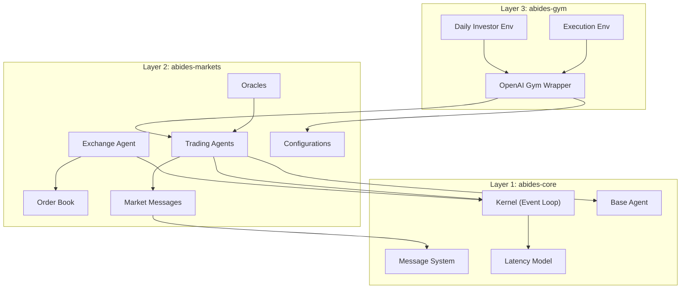
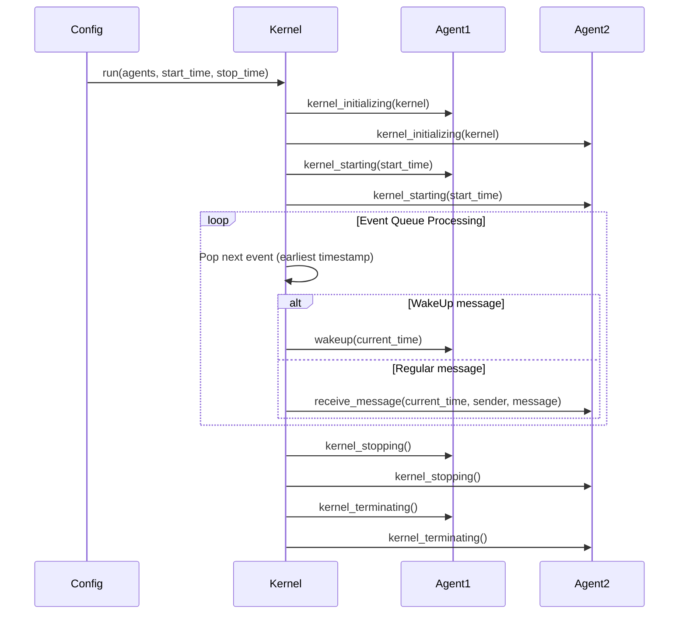
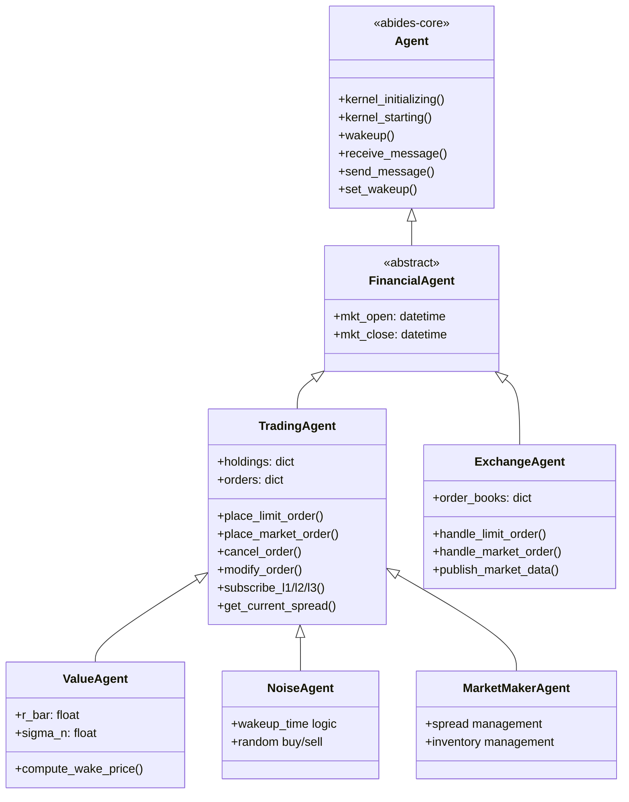
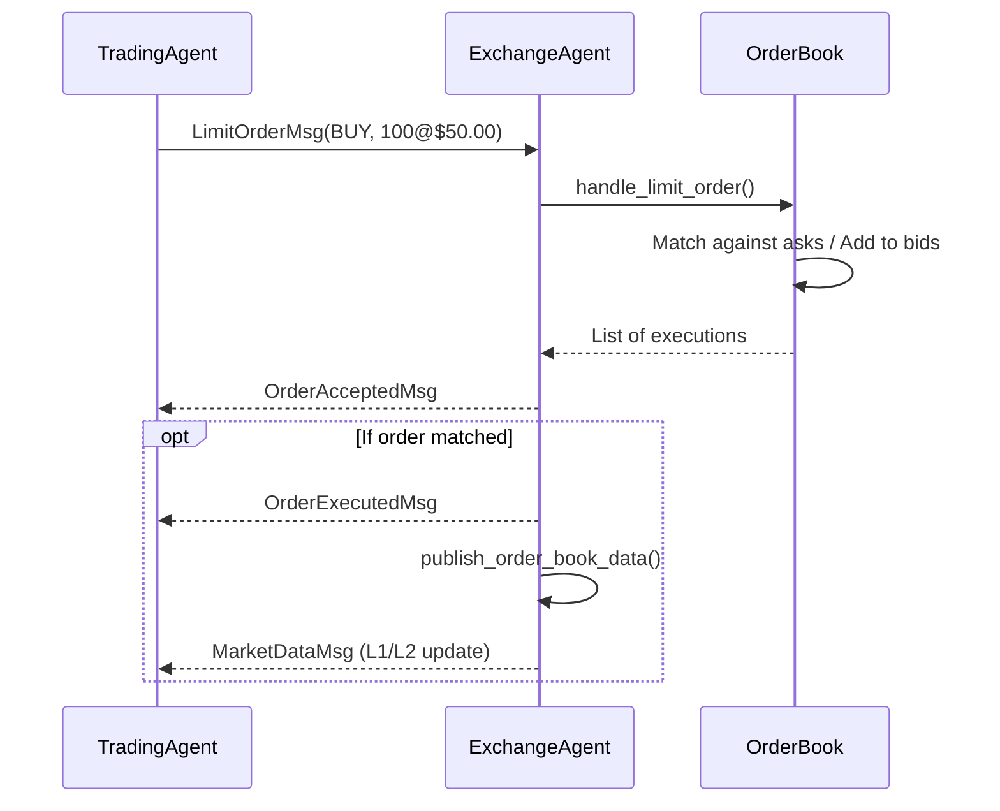
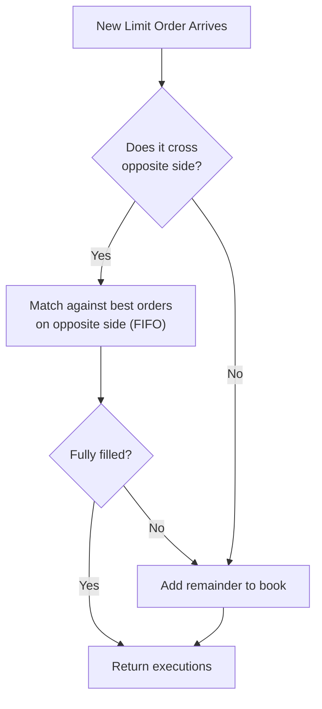
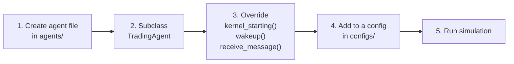
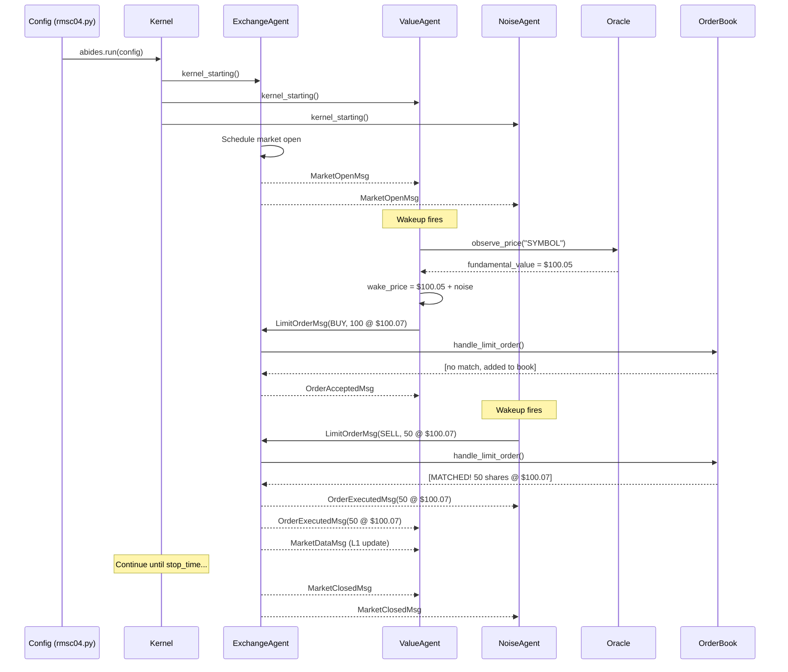

# ABIDES Market Simulator — Complete Architecture Walkthrough

ABIDES (**A**gent-**B**ased **I**nteractive **D**iscrete **E**vent **S**imulation) is a multi-agent discrete-event simulator built by JP Morgan Chase, originally designed for high-fidelity financial market simulation. The codebase is organized as a **monorepo** with three pip-installable packages that form a layered architecture.

---

## High-Level Architecture



| Layer | Package | Purpose |
|-------|---------|---------|
| **1 — Core** | `abides-core` | Domain-agnostic discrete-event simulation engine: kernel, agents, messages, latency |
| **2 — Markets** | `abides-markets` | Financial market domain: exchange, order book, trading agents, oracles, market messages |
| **3 — Gym** | `abides-gym` | OpenAI Gym wrapper for reinforcement learning on top of the market simulator |

---

# Layer 1: `abides-core` — The Simulation Engine

> [!IMPORTANT]
> This layer is **domain-agnostic**. It knows nothing about finance, orders, or markets. It provides the event-driven simulation infrastructure that `abides-markets` builds upon.

## Directory Structure

```
abides-core/abides_core/
├── __init__.py          # Package exports
├── abides.py            # Top-level run() entry point
├── kernel.py            # The simulation Kernel (event loop) — LARGEST & MOST IMPORTANT
├── agent.py             # Base Agent class
├── message.py           # Base Message class
├── latency_model.py     # Network latency simulation
├── generators.py        # Arrival-time generators (Poisson etc.)
├── utils.py             # Datetime/string helpers
```

---

### [abides.py](file:///d:/SKILLS/DREAM/ABIDES/abides-jpmc-public/abides-core/abides_core/abides.py) — Entry Point

The **single entry point** to launch a simulation. Contains one key function:

```python
def run(config, log_dir=None):
    """Takes a config dict, creates a Kernel, and runs the simulation."""
```

**Flow:**
1. Receives a config dict (built by a config file like `rmsc04.py`)
2. Extracts `start_time`, `stop_time`, `agents`, `agent_latency_model`, etc.
3. Creates a `Kernel` instance
4. Calls `kernel.run()` and returns the final agents list

> [!TIP]
> This is what you call from Python: `from abides_core import abides; abides.run(config)`

---

### [kernel.py](file:///d:/SKILLS/DREAM/ABIDES/abides-jpmc-public/abides-core/abides_core/kernel.py) — The Heart of ABIDES (~900 lines)

The `Kernel` is the **discrete-event simulation engine**. It maintains a priority queue of `(timestamp, message)` events and processes them one at a time in chronological order.

#### Key Class: `Kernel`

| Method | Purpose |
|--------|---------|
| `run(agents, ...)` | Main simulation loop — initializes agents, processes event queue until empty or `stop_time` |
| `send_message(sender, recipient, message, delay)` | Core IPC — enqueues a message with latency into the priority queue |
| `set_wakeup(agent, requested_time)` | Agent requests to be woken up at a future time |
| `write_log(agent, ...)` | Agents log data through the kernel |
| `find_agents_by_type(type)` | Lookup agents by class |

#### Simulation Lifecycle:



**Key internals:**
- Uses `heapq` priority queue — events sorted by timestamp
- Tracks `current_time` — the simulation clock
- All inter-agent communication goes through `send_message()` — agents **never** talk directly
- Latency is injected via the `LatencyModel` when messages are enqueued

---

### [agent.py](file:///d:/SKILLS/DREAM/ABIDES/abides-jpmc-public/abides-core/abides_core/agent.py) — Base Agent Class

The abstract base class all agents inherit from. **Every agent in ABIDES extends this class.**

#### Key Lifecycle Methods (override these):

| Method | When Called | Purpose |
|--------|------------|---------|
| `kernel_initializing(kernel)` | Before simulation starts | Agent gets reference to kernel |
| `kernel_starting(start_time)` | Simulation begins | Agent sets up initial state, schedules first wakeup |
| `wakeup(current_time)` | Agent's wakeup timer fires | Agent performs periodic actions |
| `receive_message(current_time, sender_id, message)` | Message arrives | Agent processes incoming messages |
| `kernel_stopping()` | Simulation ends | Agent saves results |
| `kernel_terminating()` | Final cleanup | Agent does final cleanup |

#### Key Helper Methods:

| Method | Purpose |
|--------|---------|
| `send_message(recipient_id, message)` | Send a message to another agent (routed through kernel) |
| `set_wakeup(requested_time)` | Schedule a future wakeup |
| `get_current_time()` | Get simulation clock time |
| `log_event(event_type, event, ...)` | Log an event through the kernel |

> [!NOTE]
> Agents are identified by their **index** in the agents list (integer ID). The kernel stores them in an ordered list.

---

### [message.py](file:///d:/SKILLS/DREAM/ABIDES/abides-jpmc-public/abides-core/abides_core/message.py) — Message Base Class

Simple base class for all messages. Uses Python `dataclass` for clean declaration.

```python
@dataclass
class Message:
    pass  # Subclasses add fields

class MessageBatch(Message):
    messages: List[Message]  # For sending multiple messages at once
```

All market-specific messages (orders, market data, queries) extend this base `Message` class.

---

### [latency_model.py](file:///d:/SKILLS/DREAM/ABIDES/abides-jpmc-public/abides-core/abides_core/latency_model.py) — Network Latency Simulation

Models realistic communication delays between agents.

| Class | Purpose |
|-------|---------|
| `LatencyModel` | Base class |
| `NanosecondLatencyModel` | Uses a pairwise agent-to-agent latency matrix (in nanoseconds) |

The latency model takes two agent IDs and returns a `timedelta` representing the communication delay. The kernel adds this delay when enqueuing messages.

---

### [generators.py](file:///d:/SKILLS/DREAM/ABIDES/abides-jpmc-public/abides-core/abides_core/generators.py) — Arrival Time Generators

Generates inter-arrival times for agent wakeups (e.g., how often a noise trader places orders).

| Class | Purpose |
|-------|---------|
| `ConstantTimeGenerator` | Fixed interval between wakeups |
| `PoissonTimeGenerator` | Poisson-distributed arrival times (most realistic) |

---

### [utils.py](file:///d:/SKILLS/DREAM/ABIDES/abides-jpmc-public/abides-core/abides_core/utils.py) — Utilities

Helper functions for datetime manipulation, formatting, and string parsing.

| Function | Purpose |
|----------|---------|
| `str_to_ns(s)` | Convert time string like `"10:00:00"` to nanosecond timestamp |
| `ns_date(ns)` | Convert nanosecond timestamp to date |
| `fmt_ts(ts)` | Format timestamp for display |
| `subdict(d, keys)` | Extract subset of a dictionary |
| `merge_dicts(...)` | Merge multiple dictionaries |

---

# Layer 2: `abides-markets` — Financial Market Simulation

> [!IMPORTANT]
> This is where the financial domain logic lives. It builds on `abides-core` by adding a NASDAQ-like exchange, an order book, trading agents, and market data infrastructure.

## Directory Structure

```
abides-markets/abides_markets/
├── __init__.py
├── order_book.py          # LOB (Limit Order Book) implementation
├── orders.py              # Order types (Limit, Market)
├── price_level.py         # Price level within order book
├── generators.py          # Market-specific generators
│
├── agents/                # All agent types
│   ├── financial_agent.py      # Abstract base for market agents
│   ├── trading_agent.py        # Base trading agent (sends orders)
│   ├── exchange_agent.py       # The Exchange (NASDAQ-like)
│   ├── value_agent.py          # Fundamental value trader
│   ├── noise_agent.py          # Random noise trader
│   ├── utils.py                # Agent helper functions
│   ├── market_makers/          # Market maker agents
│   ├── background_v2/          # Next-gen background agents
│   └── examples/               # Example custom agents
│
├── messages/              # Market-specific message types
│   ├── market.py              # MarketOpen/MarketClose
│   ├── marketdata.py          # L1/L2/L3/Transacted data subscriptions
│   ├── order.py               # Order messages (place/cancel/modify)
│   ├── orderbook.py           # Order book query responses
│   └── query.py               # Query messages
│
├── oracles/               # "True value" generators
│   ├── oracle.py              # Base Oracle interface
│   ├── mean_reverting_oracle.py
│   └── sparse_mean_reverting_oracle.py
│
├── models/                # Statistical models
│   └── order_size_model.py
│
├── configs/               # Ready-to-run configurations
│   ├── rmsc03.py
│   └── rmsc04.py
│
└── utils/
    └── __init__.py        # Dollar formatting, tick operations
```

---

## Agent Hierarchy



---

### [financial_agent.py](file:///d:/SKILLS/DREAM/ABIDES/abides-jpmc-public/abides-markets/abides_markets/agents/financial_agent.py) — Abstract Market Agent

A thin layer extending `Agent` with market-open/market-close time fields. All market-aware agents inherit from this.

```python
class FinancialAgent(Agent):
    """Adds mkt_open and mkt_close fields."""
```

---

### [trading_agent.py](file:///d:/SKILLS/DREAM/ABIDES/abides-jpmc-public/abides-markets/abides_markets/agents/trading_agent.py) — The Core Trading Agent (~1100 lines)

**The most important agent class for anyone adding custom traders.** It provides all the infrastructure for interacting with the exchange:

#### Order Management:
| Method | Purpose |
|--------|---------|
| `place_limit_order(symbol, quantity, side, price)` | Submit a limit order |
| `place_market_order(symbol, quantity, side)` | Submit a market order |
| `cancel_order(order)` | Cancel an existing order |
| `modify_order(order, new_order)` | Modify an existing order |

#### Market Data Subscriptions:
| Method | Purpose |
|--------|---------|
| `subscribe_l1_data(symbol)` | Subscribe to L1 (best bid/ask) |
| `subscribe_l2_data(symbol, depth)` | Subscribe to L2 (depth of book) |
| `subscribe_l3_data(symbol, depth)` | Subscribe to L3 (full order-level book) |
| `subscribe_transacted_orders(symbol)` | Subscribe to trade feed |

#### Market Data Access:
| Method | Purpose |
|--------|---------|
| `get_current_spread(symbol)` | Get current bid/ask |
| `get_known_bid(symbol)` / `get_known_ask(symbol)` | Get cached best prices |
| `get_holdings(symbol)` | Get current position |

#### Message Handling:
The `receive_message` method dispatches incoming messages to specialized handlers:
- `order_accepted()` — order acknowledged by exchange
- `order_executed()` — order filled (updates holdings & cash)
- `order_cancelled()` — order cancelled
- `market_data_update()` — L1/L2/L3 data received
- `market_closed()` — market close notification

> [!TIP]
> **To create a new trading strategy**, subclass `TradingAgent` and override `kernel_starting()` (to set your first wakeup), `wakeup()` (your periodic logic), and optionally `receive_message()` (to react to market data).

---

### [exchange_agent.py](file:///d:/SKILLS/DREAM/ABIDES/abides-jpmc-public/abides-markets/abides_markets/agents/exchange_agent.py) — The Exchange (~900 lines)

Simulates a **NASDAQ-like exchange** with a full limit order book. This is the central hub that all trading agents interact with.

#### Key Responsibilities:
- Maintains an `OrderBook` per symbol
- Processes incoming orders (limit, market, cancel, modify)
- Executes trades when orders cross
- Publishes market data (L1/L2/L3) to subscribers
- Manages market open/close schedule
- Handles order-book queries

#### Important Methods:
| Method | Purpose |
|--------|---------|
| `kernel_starting()` | Opens market at scheduled time |
| `receive_message()` | Dispatches order/query messages to handlers |
| `handle_limit_order()` | Processes incoming limit order through order book |
| `handle_market_order()` | Processes incoming market order |
| `handle_cancel_order()` | Cancels an order |
| `publish_order_book_data()` | Sends market data updates to subscribers |
| `logOrderBookSnapshots()` | Logs order book state for analysis |

#### Market Data Flow:


---

### [value_agent.py](file:///d:/SKILLS/DREAM/ABIDES/abides-jpmc-public/abides-markets/abides_markets/agents/value_agent.py) — Fundamental Value Trader

A trading agent that trades based on a **perceived fundamental value** obtained from the oracle, plus Gaussian noise.

**Key Behavior:**
1. Wakes up at random intervals
2. Gets fundamental value from oracle → adds noise → gets `wake_price`
3. Compares `wake_price` to current market spread
4. If `wake_price > ask` → BUY; if `wake_price < bid` → SELL
5. Places a limit order at the `wake_price`

This agent provides **mean-reverting pressure** on the market, anchoring prices to fundamental value.

---

### [noise_agent.py](file:///d:/SKILLS/DREAM/ABIDES/abides-jpmc-public/abides-markets/abides_markets/agents/noise_agent.py) — Random Noise Trader

A simple agent that generates **random, uniformly distributed** trading activity.

**Key Behavior:**
1. Wakes up at a random time during trading hours
2. Randomly chooses BUY or SELL (50/50)
3. Places a limit order near the current spread with a slight offset
4. Goes back to sleep (single wakeup by default)

Noise agents provide **liquidity** and **realistic microstructure noise**.

---

### Market Makers

Located in [agents/market_makers/](file:///d:/SKILLS/DREAM/ABIDES/abides-jpmc-public/abides-markets/abides_markets/agents/market_makers):

| File | Agent | Strategy |
|------|-------|----------|
| `adaptive_market_maker_agent.py` | `AdaptiveMarketMakerAgent` | Adaptive spread market maker with inventory management |
| `POV_market_maker_agent.py` | `POVMarketMakerAgent` | Percentage-of-volume market maker |

Market makers **provide liquidity** by continuously quoting buy and sell prices, managing their inventory risk.

---

### Background V2 Agents

Located in [agents/background_v2/](file:///d:/SKILLS/DREAM/ABIDES/abides-jpmc-public/abides-markets/abides_markets/agents/background_v2):

Next-generation versions of background agents with cleaner implementations:

| File | Agent |
|------|-------|
| `noise_agent_v2.py` | `NoiseAgentV2` — improved noise trader |
| `value_agent_v2.py` | `ValueAgentV2` — improved fundamental trader |
| `market_maker_agent_v2.py` | `MarketMakerAgentV2` — improved market maker |
| `momentum_agent.py` | `MomentumAgent` — trend-following trader |

---

### Example Agents

Located in [agents/examples/](file:///d:/SKILLS/DREAM/ABIDES/abides-jpmc-public/abides-markets/abides_markets/agents/examples):

| File | Purpose |
|------|---------|
| `example_experimental_agent.py` | Template showing how to build a custom trading agent |
| `impact_agent.py` | Agent that creates market impact for testing |
| `momentum_agent.py` | A simpler momentum strategy example |

> [!TIP]
> **Look at `example_experimental_agent.py` first** when building your own agent. It shows the minimal pattern needed.

---

## Order Book System

### [orders.py](file:///d:/SKILLS/DREAM/ABIDES/abides-jpmc-public/abides-markets/abides_markets/orders.py) — Order Types

Defines the order data structures:

```python
class Side(Enum):
    BID = 1   # Buy
    ASK = 2   # Sell

@dataclass
class Order:
    agent_id: int
    time_placed: datetime
    symbol: str
    quantity: int
    side: Side
    order_id: int
    ...

class LimitOrder(Order):
    limit_price: int   # in cents (integer!)
    is_hidden: bool

class MarketOrder(Order):
    pass
```

> [!WARNING]
> **Prices are stored as integers (cents)**, not floats! `$100.00` → `10000`. This avoids floating-point precision issues.

---

### [price_level.py](file:///d:/SKILLS/DREAM/ABIDES/abides-jpmc-public/abides-markets/abides_markets/price_level.py) — Price Level

Represents a **single price level** in the order book — a FIFO queue of all orders at the same price.

```python
class PriceLevel:
    price: int
    visible_orders: List[LimitOrder]    # Regular orders
    hidden_orders: List[LimitOrder]     # Iceberg/hidden orders
    total_visible_quantity: int
```

Orders at the same price are matched in **FIFO (time priority)** order.

---

### [order_book.py](file:///d:/SKILLS/DREAM/ABIDES/abides-jpmc-public/abides-markets/abides_markets/order_book.py) — Limit Order Book (~1000 lines)

The **full Limit Order Book (LOB)** implementation. Maintains two sides:
- **Bids** (buy orders) — sorted descending by price
- **Asks** (sell orders) — sorted ascending by price

#### Key Methods:
| Method | Purpose |
|--------|---------|
| `handle_limit_order(order)` | Process a new limit order — match or add to book |
| `handle_market_order(order)` | Process a market order — match immediately |
| `cancel_order(order)` | Remove an order from the book |
| `modify_order(old, new)` | Replace an order |
| `get_l1_bid_data()` / `get_l1_ask_data()` | Get best bid/ask |
| `get_l2_bid_data(depth)` / `get_l2_ask_data(depth)` | Get depth-of-book |
| `get_l3_bid_data(depth)` / `get_l3_ask_data(depth)` | Get full order-level data |
| `get_transacted_orders(...)` | Get recent trades |

#### Matching Engine Logic:


---

## Message System

All inter-agent communication uses typed messages. Here's the complete taxonomy:

### [messages/market.py](file:///d:/SKILLS/DREAM/ABIDES/abides-jpmc-public/abides-markets/abides_markets/messages/market.py) — Market Lifecycle

| Message | Direction | Purpose |
|---------|-----------|---------|
| `MarketOpenMsg` | Exchange → All | Market is now open |
| `MarketClosedMsg` | Exchange → All | Market is now closed |
| `MarketClosePriceRequestMsg` | Agent → Exchange | Request closing price |
| `MarketClosePriceMsg` | Exchange → Agent | Closing price response |

### [messages/order.py](file:///d:/SKILLS/DREAM/ABIDES/abides-jpmc-public/abides-markets/abides_markets/messages/order.py) — Order Messages

| Message | Direction | Purpose |
|---------|-----------|---------|
| `LimitOrderMsg` | Agent → Exchange | Place a limit order |
| `MarketOrderMsg` | Agent → Exchange | Place a market order |
| `CancelOrderMsg` | Agent → Exchange | Cancel an order |
| `ModifyOrderMsg` | Agent → Exchange | Modify an order |
| `ReplaceOrderMsg` | Agent → Exchange | Replace an order |
| `OrderAcceptedMsg` | Exchange → Agent | Order accepted confirmation |
| `OrderExecutedMsg` | Exchange → Agent | Order was filled |
| `OrderCancelledMsg` | Exchange → Agent | Order was cancelled |

### [messages/query.py](file:///d:/SKILLS/DREAM/ABIDES/abides-jpmc-public/abides-markets/abides_markets/messages/query.py) — Queries

| Message | Direction | Purpose |
|---------|-----------|---------|
| `QuerySpreadMsg` / `QuerySpreadResponseMsg` | Agent ↔ Exchange | Request current spread |
| `QueryLastTradeMsg` / `QueryLastTradeResponseMsg` | Agent ↔ Exchange | Request last trade |
| `QueryOrderStreamMsg` / `QueryOrderStreamResponseMsg` | Agent ↔ Exchange | Request order stream |
| `QueryTransactedVolMsg` / `QueryTransactedVolResponseMsg` | Agent ↔ Exchange | Request volume |

### [messages/marketdata.py](file:///d:/SKILLS/DREAM/ABIDES/abides-jpmc-public/abides-markets/abides_markets/messages/marketdata.py) — Market Data Subscriptions

| Message | Purpose |
|---------|---------|
| `MarketDataSubReqMsg` | Subscribe to market data |
| `L1SubReqMsg` / `L2SubReqMsg` / `L3SubReqMsg` | Level-specific subscription requests |
| `MarketDataMsg` | Market data update (bid/ask/last trade) |
| `L2DataMsg` | Level 2 depth data |
| `L3DataMsg` | Level 3 order-level data |
| `TransactedVolSubReqMsg` | Subscribe to transacted volume |
| `BookImbalanceDataMsg` | Order book imbalance data |

---

## Oracle System

Oracles provide the **"true" fundamental value** of a stock. Agents (especially `ValueAgent`) query the oracle to decide what a stock is "worth."

### [oracle.py](file:///d:/SKILLS/DREAM/ABIDES/abides-jpmc-public/abides-markets/abides_markets/oracles/oracle.py) — Base Oracle

```python
class Oracle:
    def get_daily_open_price(symbol, mkt_open): ...
```

### [mean_reverting_oracle.py](file:///d:/SKILLS/DREAM/ABIDES/abides-jpmc-public/abides-markets/abides_markets/oracles/mean_reverting_oracle.py) — Mean-Reverting Oracle

Generates a fundamental value time series using an **Ornstein-Uhlenbeck (OU) process** — the price fluctuates randomly but reverts to a mean over time.

| Parameter | Meaning |
|-----------|---------|
| `r_bar` | Long-run mean price |
| `kappa` | Speed of mean reversion |
| `sigma_s` | Volatility of the process |
| `fund_vol` | Fundamental volatility |
| `megashock_lambda_a` | Large shock arrival rate |

```python
oracle.observe_price(symbol, current_time, random_state)  # → fundamental value
```

### [sparse_mean_reverting_oracle.py](file:///d:/SKILLS/DREAM/ABIDES/abides-jpmc-public/abides-markets/abides_markets/oracles/sparse_mean_reverting_oracle.py) — Sparse Mean-Reverting Oracle

A more efficient version that generates the OU process with **sparse updates** (only computes values when queried), using megashocks for regime changes.

---

## Models

### [order_size_model.py](file:///d:/SKILLS/DREAM/ABIDES/abides-jpmc-public/abides-markets/abides_markets/models/order_size_model.py) — Order Size Model

Generates realistic order sizes from statistical distributions.

---

## Configurations

### [rmsc04.py](file:///d:/SKILLS/DREAM/ABIDES/abides-jpmc-public/abides-markets/abides_markets/configs/rmsc04.py) — Reference Market Simulation Config 04

This is a **ready-to-run configuration** that assembles a complete market simulation:

```python
def build_config(seed, end_time, ...):
    # Creates and returns a config dict with:
    # - 1 Exchange Agent
    # - 2 Market Maker Agents
    # - 102 Value Agents
    # - 12 Momentum Agents
    # - 1000 Noise Agents
    # - Latency model
    # - Oracle (SparseMeanRevertingOracle)
    # - Start/stop times
```

The config builds the full agent list, assigns them parameters, configures the oracle, sets up latency, and returns a dict that `abides.run()` can consume.

| Config | Composition |
|--------|-------------|
| `rmsc03` | 1 Exchange, 1 POV Market Maker, 100 Value, 25 Momentum, 5000 Noise |
| `rmsc04` | 1 Exchange, 2 Market Makers, 102 Value, 12 Momentum, 1000 Noise |

> [!TIP]
> **To add a new simulation scenario**, create a new config file in `configs/` following the pattern of `rmsc04.py`. This is also where you add your custom agent to a simulation.

---

## Market Utilities

### [utils/__init__.py](file:///d:/SKILLS/DREAM/ABIDES/abides-jpmc-public/abides-markets/abides_markets/utils/__init__.py) — Market Helpers

| Function | Purpose |
|----------|---------|
| `dollarize(cents)` | Convert cents to `$XX.XX` string |
| `get_wake_time(open, close)` | Generate random wakeup time during market hours |
| `tick_to_rate(...)` | Convert tick size to rate |
| `configure_agents(...)` | Helper for building agent configs |

### [generators.py](file:///d:/SKILLS/DREAM/ABIDES/abides-jpmc-public/abides-markets/abides_markets/generators.py) — Market-Specific Generators

Market-specific arrival time generators extending the core generators.

---

# Layer 3: `abides-gym` — OpenAI Gym Integration

> [!IMPORTANT]
> This layer wraps ABIDES simulations as OpenAI Gym environments, enabling reinforcement learning. Your RL agent becomes one of the trading agents in the simulation.

## Directory Structure

```
abides-gym/abides_gym/
├── __init__.py                                    # Registers Gym environments
├── envs/
│   ├── __init__.py
│   ├── core_environment.py                        # Base ABIDES Gym env
│   ├── markets_environment.py                     # Markets-specific base
│   ├── markets_daily_investor_environment_v0.py   # Daily investor env
│   ├── markets_execution_environment_v0.py        # Execution quality env
│   └── markets_execution_custom_metrics.py        # Execution metrics
├── experimental_agents/                           # Gym-specific agents
└── scripts/                                       # Helper scripts
```

---

### [core_environment.py](file:///d:/SKILLS/DREAM/ABIDES/abides-jpmc-public/abides-gym/abides_gym/envs/core_environment.py) — Base Gym Environment

The foundation class that bridges ABIDES and OpenAI Gym.

#### Key Design:
- Wraps the ABIDES `Kernel` as a Gym environment
- The kernel runs the simulation **step by step** — each Gym `step()` corresponds to one action by the RL agent
- Background agents continue to run between RL agent actions
- The RL agent is a special `ExperimentalAgent` inserted into the simulation

#### Key Methods:
| Method | Purpose |
|--------|---------|
| `reset()` | Initialize a new simulation, return initial observation |
| `step(action)` | Execute one RL action, advance simulation, return (obs, reward, done, info) |
| `raw_state_to_observation(raw_state)` | **Override this** — convert sim state to Gym observation space |
| `raw_state_to_reward(raw_state)` | **Override this** — compute reward from sim state |
| `raw_state_to_action(action)` | **Override this** — convert Gym action to ABIDES action |
| `raw_state_to_update_reward(raw_state)` | **Override this** — update running reward |

---

### [markets_environment.py](file:///d:/SKILLS/DREAM/ABIDES/abides-jpmc-public/abides-gym/abides_gym/envs/markets_environment.py) — Markets Gym Base

Extends `AbidesCoreGymEnv` with market-specific initialization:
- Loads market configs (e.g., `rmsc04`)
- Inserts the RL agent as an `ExperimentalAgent` into the agent list
- Configures the RL agent's subscriptions

---

### [markets_daily_investor_environment_v0.py](file:///d:/SKILLS/DREAM/ABIDES/abides-jpmc-public/abides-gym/abides_gym/envs/markets_daily_investor_environment_v0.py) — Daily Investor Environment

A complete Gym environment for a **daily portfolio allocation** RL problem:

| Aspect | Details |
|--------|---------|
| **Action Space** | Discrete — amount of shares to buy/hold/sell |
| **Observation Space** | Holdings, spread, returns, volume, etc. |
| **Reward** | Marked-to-market PnL of the portfolio |
| **Episode** | One trading day |

---

### [markets_execution_environment_v0.py](file:///d:/SKILLS/DREAM/ABIDES/abides-jpmc-public/abides-gym/abides_gym/envs/markets_execution_environment_v0.py) — Execution Environment

A Gym environment for **optimal trade execution** — the RL agent must execute a large order with minimum market impact:

| Aspect | Details |
|--------|---------|
| **Action Space** | Discrete — chunk sizes to execute |
| **Observation Space** | Time remaining, inventory remaining, spread, etc. |
| **Reward** | Implementation shortfall (difference from arrival price) |
| **Episode** | Execution of a parent order |

---

### [markets_execution_custom_metrics.py](file:///d:/SKILLS/DREAM/ABIDES/abides-jpmc-public/abides-gym/abides_gym/envs/markets_execution_custom_metrics.py)

Custom metrics for evaluating execution quality (VWAP, implementation shortfall, etc.). Used by RLlib callbacks.

---

# Where to Add Your Things

Here's a practical guide for the most common customization points:

## Adding a New Trading Agent



**Files to touch:**
1. **Create**: `abides-markets/abides_markets/agents/my_agent.py`
   - Subclass `TradingAgent`
   - Override `kernel_starting()` — set your first wakeup
   - Override `wakeup()` — your trading logic
   - Override `receive_message()` — react to market data (optional)

2. **Modify**: `abides-markets/abides_markets/agents/__init__.py`
   - Add your import

3. **Modify**: A config file (e.g., `configs/rmsc04.py`) or create a new one
   - Instantiate your agent and add it to the agents list

### Template for a New Agent:
```python
from abides_markets.agents.trading_agent import TradingAgent

class MyAgent(TradingAgent):
    def __init__(self, id, name, type, symbol, ...):
        super().__init__(id, name, type, ...)
        self.symbol = symbol
        # Your custom parameters
    
    def kernel_starting(self, start_time):
        super().kernel_starting(start_time)
        # Schedule first wakeup
        self.set_wakeup(self.mkt_open)
    
    def wakeup(self, current_time):
        super().wakeup(current_time)
        # Your trading logic here
        spread = self.get_current_spread(self.symbol)
        if spread:
            bid, ask = spread
            # Decide and place orders
            self.place_limit_order(self.symbol, 100, Side.BID, bid)
        
        # Schedule next wakeup
        self.set_wakeup(current_time + self.get_wake_frequency())
    
    def receive_message(self, current_time, sender_id, message):
        super().receive_message(current_time, sender_id, message)
        # React to market data, order fills, etc.
```

---

## Adding a New Message Type

**Files to touch:**
1. **Create/Modify**: `abides-markets/abides_markets/messages/my_messages.py`
   - Subclass `Message` from `abides_core.message`
2. **Modify**: The agents that send/receive this message

---

## Adding a New Oracle

**Files to touch:**
1. **Create**: `abides-markets/abides_markets/oracles/my_oracle.py`
   - Subclass `Oracle`
   - Implement `observe_price()` and `get_daily_open_price()`
2. **Modify**: Config file to use your oracle

---

## Adding a New Gym Environment

**Files to touch:**
1. **Create**: `abides-gym/abides_gym/envs/my_environment.py`
   - Subclass `AbidesMarketsGymEnv`
   - Define `observation_space` and `action_space`
   - Implement `raw_state_to_observation()`, `raw_state_to_reward()`, `raw_state_to_action()`
2. **Modify**: `abides-gym/abides_gym/__init__.py`
   - Register your environment with `gym.envs.registration.register()`

---

## Adding a New Config (Simulation Scenario)

**Files to touch:**
1. **Create**: `abides-markets/abides_markets/configs/my_config.py`
   - Define `build_config(seed, end_time, ...)` function
   - Instantiate your agents, oracle, latency model
   - Return the config dict

---

## Complete Message Flow — End to End



---

## Key Design Patterns

| Pattern | Where | Why |
|---------|-------|-----|
| **Message-passing** | All agent communication | Agents never call each other directly; everything goes through the kernel's message queue, enabling latency simulation |
| **Discrete-event simulation** | Kernel | Only processes events when they happen (no fixed time steps), making it efficient |
| **Template Method** | Agent lifecycle | Base classes define the skeleton; subclasses fill in behavior via `wakeup()`, `receive_message()`, etc. |
| **Observer** | Market data subscriptions | Agents subscribe to market data; exchange publishes updates |
| **Strategy** | Oracles, Latency Models | Swappable oracle and latency implementations |
| **Config-as-code** | Config files | Each simulation scenario is a Python function that assembles agents and parameters |

---

## Summary — File Importance by Use Case

| If you want to... | Read these files | Modify these files |
|-------------------|------------------|-------------------|
| **Understand the simulator** | `kernel.py`, `agent.py`, `abides.py` | — |
| **Create a new trading agent** | `trading_agent.py`, `value_agent.py` (as example) | Create new agent file + modify config |
| **Change order book behavior** | `order_book.py`, `price_level.py`, `orders.py` | `order_book.py` |
| **Add a new oracle/price model** | `mean_reverting_oracle.py` | Create new oracle file + modify config |
| **Create a new RL environment** | `core_environment.py`, `markets_daily_investor_environment_v0.py` | Create new env file + modify `__init__.py` |
| **Create a new simulation scenario** | `rmsc04.py` | Create new config file |
| **Add new message types** | `messages/` directory | Create new message file |
